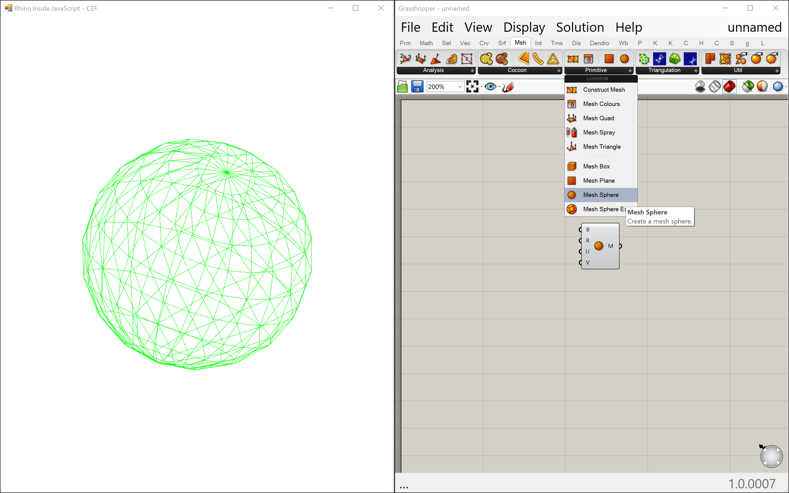

# Rhino.Inside.CEF 
### Running Rhino and Grasshopper inside Chromium Embedded Framework (CEF) via CEFSharp

This sample shows how to run Rhino.Inside the Chromium Embedded Framework. 
This sample has two parts:
1. `InsideCEF.WinForms`: A .NET .csproj which uses CEFSharp. Includes the code to initialize CEF inside a WinForms.Form window. Also includes code to start Rhino and Grasshopper, implemented in a custom `TaskScheduler`.
2. `InsideCEF.WebApp`: An html / JavaScript app using rhino3dm.js to deserialize geometry and three.js to visualize geometry.

## Dependencies

Beyond RhinoCommon and Grasshopper APIs, this project depends on the following libraries / frameworks:
- [`CefSharp`](http://cefsharp.github.io/) (CefSharp.WinForms.dll, CefSharp.Core.dll, and CefSharp.dll referenced via the NuGet Package)
- [`Json.NET`](https://www.newtonsoft.com/json) (Referenced via the NuGet package)
- [`rhino3dm.js`](https://www.rhino3d.com/rhino3dm) (Referenced via URL)
- [`three.js`](https://threejs.org/) (Referenced via URL)

## Running the Sample

This assumes you already have a clone or copy of the Rhino.Inside repository on your computer.

1. Open the `InsideCEF.sln` solution in Visual Studio. 
2. Start debugging. First you'll see a window appear which should be the Winforms window with CEF embedded. Next you'll see the Chrome Dev Tools window appear. After a bit of time, you should see Grasshopper appear. Create some meshes in Grasshopper and you should see them appear in the CEF window:

As you continue to develop the definition, the rendered geometry will update to reflect what you have defined in the Grasshopper canvas.

Note: Visual Studio might take a bit of time to resolve NuGet dependencies the first time you open the project solution. You might get build errors if you try to run the sample prior to these packages being resolved.

